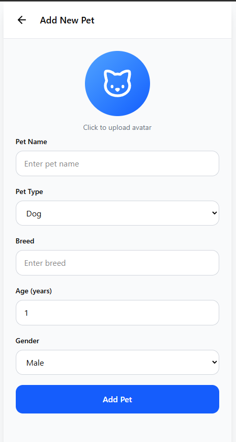
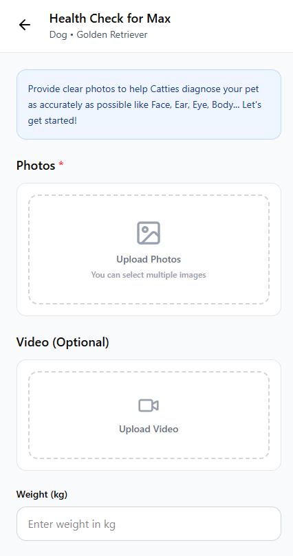
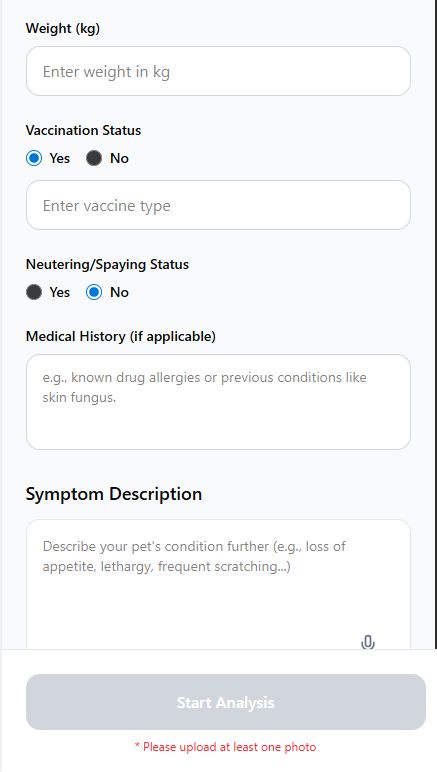

# PetHealthCare

PetHealthCare is a mobile-first pet health assistant focused on dog/cat triage support.
Users can create pet profiles, run AI-assisted health checks from photos/videos, and track analysis history over time.

## What This App Does

- Create and manage pet profiles (name, species, breed, age, gender, avatar)
- Run health checks with photo/video upload
- Receive structured AI triage output:
  - status, severity, possible diagnosis
  - symptoms/evidence
  - red flags and next actions
- View historical analyses in pet profile/history screens
- Support bilingual UX (Vietnamese / English)
- Apply backend cost controls (cache, cooldown, in-flight lock, rate limits)

## Tech Stack

- **Frontend:** Expo + React Native + TypeScript + NativeWind
- **Backend:** Node.js + Express
- **Database/Auth/Storage:** Supabase
- **AI:** Google Gemini (JSON-constrained prompt output)

## Repository Structure

- `pet-health-frontend/` - Expo React Native app
- `pet-health-backend/` - Express API + AI orchestration
- `pet-health-context/` - project docs, prompt docs, testing/setup notes
- `figma/` - UI references and design assets

## App Preview

> Initial UI preview images from the current repository assets.

### Add New Pet



### Health Check




## Getting Started

### 1) Backend

```bash
cd pet-health-backend
yarn install
yarn start
```

### 2) Frontend

```bash
cd pet-health-frontend
yarn install
yarn dev
```

## Environment Setup

- Backend env template: `pet-health-backend/.env.example`
- Required services:
  - Supabase project
  - Gemini API key

## Testing

- Backend:
  ```bash
  cd pet-health-backend
  yarn test
  ```
- Frontend:
  ```bash
  cd pet-health-frontend
  yarn test
  ```

## Notes

- Current release phase keeps email/password auth active in UI.
- Social login UI (Google/Apple) is temporarily commented out and can be re-enabled later.
- Prompt formats are documented in `pet-health-context/PROMPTS.md`.

