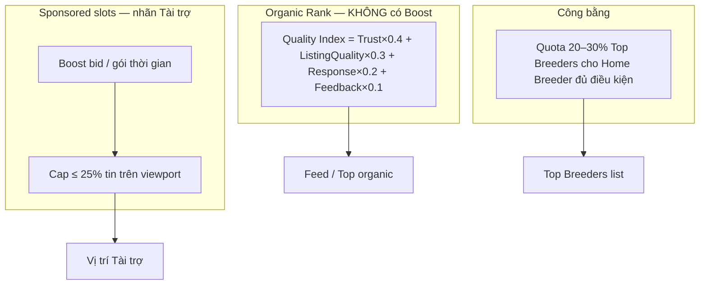
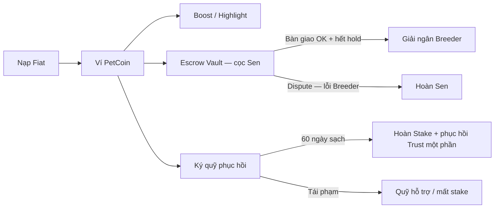
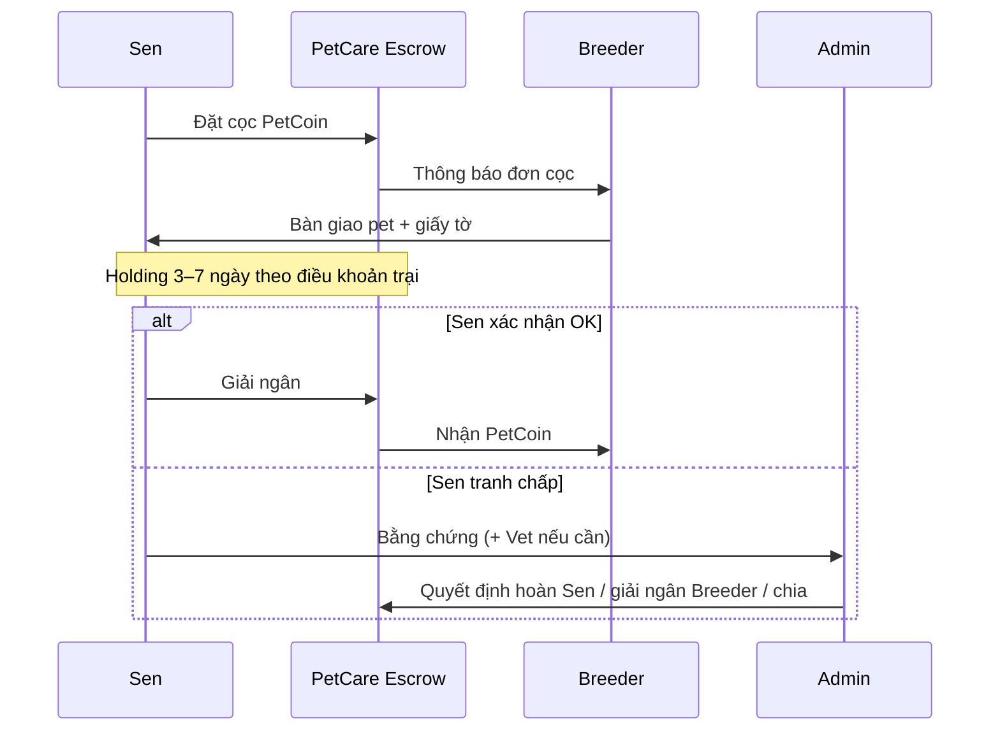

# Design Context & Research: Breeder Competition, Accuracy & PetCoin Economy

**Dự án:** Pet Health Care (App *PetCare*)  
**Module:** Breeder Surfaces & Marketplace Economy  
**Mục tiêu:** Môi trường cạnh tranh lành mạnh cho Breeder, ràng buộc thông tin chính xác, và mô hình **PetCoin** (tương lai) — Ads / Escrow / Ký quỹ phục hồi uy tín.  
**Ngày cập nhật:** 2026-07-30  
**Đối tượng:** Product Owner, Designer Figma, Lead Developer  
**Trạng thái:** Design strategy — **chưa ship payment**. Annotation Figma bắt buộc: `SHIPPED` | `PHASE 1 DESIGN` | `PHASE 2 DATA` | `NEW` | `DATA LATER`

**Liên quan:**
- UI hiện tại: [`MOBILE_BREEDER_DESIGN_CONTEXT.md`](./MOBILE_BREEDER_DESIGN_CONTEXT.md) · [`WEB_BREEDER_DESIGN_CONTEXT.md`](./WEB_BREEDER_DESIGN_CONTEXT.md)
- Research nháp trước (tham chiếu): [`BREEDER_COMPETITION_TRUST_COIN_FIGMA.md`](./BREEDER_COMPETITION_TRUST_COIN_FIGMA.md)
- Index: [`BREEDER_UI_FIGMA_BRIEF.md`](./BREEDER_UI_FIGMA_BRIEF.md)

> **Disclaimer sản phẩm (bắt buộc trên UI marketplace):** Tin đăng do người dùng đăng. Pet Health Care không phải bên bán, **không bảo lãnh sức khỏe thú**, và (ở MVP) **chưa xử lý thanh toán**. Escrow/PetCoin là đề xuất phase — mọi “cam kết bảo hành” trên tin là **cam kết của Breeder**, không phải bảo đảm của platform.

---

## 0. Tóm tắt điều hành

1. **Cạnh tranh công bằng:** Organic ranking theo chất lượng và minh bạch; **Boost/Sponsored tách slot**, cap %; quota Home Breeder; không tô đỏ “giá xả”.
2. **Độ chính xác:** Thang xác thực 3 tầng (map dần từ `verified` hiện tại); bằng chứng y tế khi khai “đã tiêm”; watermark; report → **Admin review** → penalty.
3. **PetCoin:** Boost → Escrow đặt cọc → **Ký quỹ phục hồi uy tín** (không mua Trust Score).
4. **Figma:** Vẽ ngay UI phase với nhãn; không đợi backend payment.

---

## 1. Triết lý và cạnh tranh công bằng

### 1.1 Thách thức thị trường

| Vấn đề | Hệ quả |
|--------|--------|
| Phá giá / chất lượng kém | Sen nhận pet rủi ro; uy tín marketplace giảm |
| Spam tin / độc quyền top | Home Breeder tâm huyết bị đè |
| Ảnh mạng / review giả | Trust giả; Sen mất tiền/cọc ngoài app |

### 1.2 Nguyên tắc

1. **Chất lượng và minh bạch > ngân sách ads** trong organic.
2. **Boost không được lách vào điểm organic.**
3. **Tôn vinh chăm sóc** (vaccine, môi trường, cam kết trại) hơn đua giá rẻ.
4. **Không pay-to-win Trust.** Coin chỉ: ads, escrow, ký quỹ (stake) có điều kiện.
5. **Không hứa “an toàn 100% / bảo đảm khỏe”** từ phía PetCare.

### 1.3 Kiến trúc xếp hạng (đã chỉnh)



**Quality Index (organic — đề xuất):**

```
QualityIndex =
  0.40 * TrustScoreNormalized      // 0–100 (hiện client-side; sau server)
+ 0.30 * ListingQualityScore       // đủ field, ảnh ≥ N, vaccine note, ít bị reject
+ 0.20 * ResponseHealth            // tỉ lệ trả lời DM trong SLA — DATA LATER
+ 0.10 * SenFeedbackOrRepeat       // DATA LATER; không dùng review giả
```

**Không** cộng `BoostCoefficient` vào Quality Index.

**Chống độc quyền:**

| Cơ chế | Spec |
|--------|------|
| Sponsored cap | ≤ **25%** tin có nhãn Tài trợ / viewport Feed |
| Home Breeder quota | **20–30%** slot Top Breeders cho `breederType = home_breeder` (hoặc scale nhỏ) + Trust ≥ ngưỡng + đã verified |
| Impression / boost cooldown | Giới hạn số lần Boost / trại / tuần (TBD PO) |
| Badge tích cực | “Minh bạch tháng”, “Môi trường đạt chuẩn” — không chỉ “bán nhiều” |

**UI giá và chất lượng trên card tin:**

- **Không** style giá siêu rẻ kiểu xả hàng (đỏ đậm, “SỐC”).
- Ưu tiên chip: sổ tiêm / cam kết của trại / môi trường / Escrow (nếu bật) — copy trung tính.

---

## 2. Độ chính xác và trách nhiệm (Accuracy)

### 2.1 Ba tầng xác thực (Verification Tiers)

Map với trạng thái hiện tại (`unverified | pending_review | verified | rejected | suspended`):

| Tầng | Cấp độ | Yêu cầu | Quyền lợi | Phase |
|------|--------|---------|-----------|-------|
| **Tier 0** | Chưa xác minh / chờ duyệt | Form + cam kết hiện có | Chưa lên Top Breeders | `SHIPPED` |
| **Tier 1** | Danh tính cơ bản | SĐT/liên hệ chính chủ; (sau) eKYC/CCCD | Đăng tin theo hạn mức mềm | `PHASE 1 DESIGN` — eKYC TBD |
| **Tier 2** | Môi trường trại | Video không gian nuôi + (tuỳ) GPS / giấy phép | Badge “Trại đã xác minh”; Trust signal mạnh; hạn mức đăng rộng | `PHASE 1 DESIGN` |
| **Tier 3** | Bảo chứng (Elite) | Ký quỹ PetCoin + cam kết điều khoản giao dịch của trại | Badge “Bảo chứng giao dịch”; ưu tiên organic nhẹ (không thay Boost) | `PHASE 2 DATA` |

> **PO chốt:** Hạn mức “3 tin/tháng” ở Tier 1 — giả thuyết; có thể nới nếu làm khó Home Breeder quá mức.

### 2.2 Ràng buộc trên UI đăng tin

| Cơ chế | Spec | Phase |
|--------|------|-------|
| Health evidence | Khi chọn “Đã tiêm phòng” → **bắt buộc** upload ảnh sổ/tem (không = không được tick) | `PHASE 1 DESIGN` |
| Watermark | Auto watermark `[PetCare] + [Tên trại] + [Pet ID]` — **preview** trước đăng; bắt buộc với tin Escrow/Boost; cân nhắc opt-in tin thường | `PHASE 1 DESIGN` |
| Report + bằng chứng | Sen kèm chat/ảnh/video | `SHIPPED` (report) + nâng evidence `NEW` |
| Penalty | Chỉ sau **Admin xác nhận** report hợp lệ → trừ Trust / khóa đăng / điểm lỗi | `PHASE 1 DESIGN` |
| Mức trừ gợi ý | 10–30 Trust tùy severity (TBD); **không** trừ ngay khi mới bấm Report | — |

### 2.3 Điểm lỗi và phục hồi (không mua điểm)

- **Không** bán Trust Score.
- **Ký quỹ phục hồi (Stake remediation):** nộp PetCoin giữ **60 ngày**; không tái phạm → hoàn + phục hồi Trust **từng phần**; tái phạm → mất ký quỹ → quỹ hỗ trợ Sen (policy TBD).
- Một số vi phạm **không** được stake (scam, giả mạo danh tính, bạo hành) — chỉ kháng cáo Admin.

---

## 3. PetCoin Economy

### 3.1 Vai trò

PetCoin = nhiên liệu **ads** + **escrow** + **stake** — không phải tiền mua uy tín giả.



### 3.2 Luồng sử dụng

**A. Quảng cáo (`PHASE 1 DESIGN` → `PHASE 2 DATA`)**

| Sản phẩm | Mô tả UI |
|----------|----------|
| Boost Post | 24h / 3 ngày / 7 ngày — giá Coin **TBD** |
| Highlight Storefront | Banner / nhãn “Nổi bật tuần” — tách khỏi organic Top |

Nhãn tin boost: **“Tài trợ”** — xám trung tính, không lấn át tin organic.

**B. Escrow / Đặt cọc (`PHASE 1 DESIGN` → `PHASE 2 DATA`)**

1. Sen chọn “Đặt cọc qua PetCare” trên tin (Breeder phải bật toggle).
2. Coin/tiền vào **Escrow Vault** (platform giữ trung gian).
3. Breeder giao pet + giấy tờ.
4. **Holding period 3–7 ngày** (theo dõi theo **điều khoản cam kết của trại**, không phải bảo lãnh y tế PetCare).
5. Sen xác nhận OK → giải ngân Breeder; hoặc **Raise Dispute** → Admin (+ bằng chứng Vet nếu cần).
6. Sen đổi ý không nhận / Breeder không lỗi → policy bồi thường cọc (TBD; UI cần state rõ).

**Copy cấm trên badge:** “Bảo đảm khỏe mạnh”, “Không Parvo”.  
**Copy nên dùng:** “Giao dịch có đặt cọc · Theo dõi theo điều khoản trại · Tranh chấp qua PetCare”.

**C. Ký quỹ phục hồi uy tín (`PHASE 2 DATA`)**

Xem §2.3 — CTA: “Ký quỹ khôi phục điểm uy tín” (không: “Mua lại điểm”).

### 3.3 Pricing (TBD PO)

Ví dụ placeholder Figma only: 50k₫ ≈ 50 PC; 200k₫ ≈ 220 PC (+10%). **Không** khóa số trên production copy cho đến khi PO chốt.

---

## 4. Roadmap phase (Figma ↔ Eng)

| Phase | Nội dung | Figma | Eng |
|-------|----------|-------|-----|
| **Now** | Ranking fairness copy/UI; evidence checklist; Farm Health penalty empty; nhãn Tài trợ mock | `PHASE 1 DESIGN` | Có thể ship một phần không-coin |
| **A** | Ví PetCoin + Boost + Sponsor cap | `PHASE 1 DESIGN` | Payment provider |
| **B** | Escrow deposit + stepper + dispute | `PHASE 1 DESIGN` | Ledger + admin tools |
| **C** | Tier 2/3 + Stake remediation | `PHASE 1 DESIGN` / `PHASE 2 DATA` | Policy + freeze wallet |

---

## 5. UI Components mới (Design System)

| Component | Spec | Phase |
|-----------|------|-------|
| `PetCoinWidget` | Icon coin + số dư + “+ Nạp” Primary `#1E6FE8` — Account, Farm Health, checkout | A |
| `EscrowBadge` | Chip emerald + shield — “Đặt cọc qua PetCare · Theo dõi X ngày” | B |
| `VerificationTierBadge` | T1 slate / T2 `#1E6FE8` / T3 gold crown | 1–3 |
| `BoostOptionCard` | Gói 24h / 3d / VIP — radio, preview vị trí **Tài trợ** | A |
| `SponsoredTag` | “Tài trợ” xám nhã | A |
| `DisputeEscrowModal` | Upload bằng chứng, lý do, trạng thái Admin | B |
| `StakeRemediationCard` | Số Coin đóng băng, countdown 60 ngày, điều kiện | C |
| `WatermarkPreview` | Trước/sau ảnh | Now–A |
| `HealthEvidenceUploader` | Bắt buộc khi tick tiêm phòng | Now |

Giữ visual family: Primary `#1E6FE8`, bg `#F2F4F8`, verified emerald — tránh purple AI generic trừ template T3.

---

## 6. Screen inventory (cập nhật Figma)

### A. Pet Feed / Breeders / Post card — cập nhật

- Chip Escrow trên tin (nếu bật).
- Top Breeders: filter “Chỉ trại đã xác minh (Tier 2+)” — optional.
- Tin Boost: `SponsoredTag`.
- Organic list **không** bị sắp xếp theo tiền Boost.

### B. Farm Health (Owner) — cập nhật

- Section **Tài chính và Bảo chứng:** số dư PetCoin; stake đang đóng băng.
- Section **Vi phạm / điểm lỗi:** lý do sau Admin duyệt; CTA “Ký quỹ khôi phục” / “Khiếu nại minh oan”.
- Giữ score ring Trust hiện có (`SHIPPED` logic client).

### C. Create / Edit listing — cập nhật

- Toggle: “Chấp nhận đặt cọc qua PetCare Escrow”.
- Upload bắt buộc sổ tiêm nếu khai đã tiêm.
- Watermark preview.

### D. `PetCoinWalletScreen` — MỚI

- Số dư + quy đổi VND (ước lượng).
- Gói nạp (placeholder).
- History tabs: Tất cả | Nạp | Quảng cáo | Đặt cọc | Ký quỹ.

### E. `EscrowTransactionDetailScreen` — MỚI

Stepper:

1. Sen đã cọc
2. Breeder chuẩn bị / gửi
3. Sen nhận · đang theo dõi (X ngày theo điều khoản)
4. Giải ngân hoàn tất

CTA Sen: xác nhận giải ngân / tranh chấp.  
CTA Breeder: đã giao vận chuyển / đã bàn giao.

### F. Flows bổ sung

- Boost purchase sheet từ “Bài của tôi”.
- Stake remediation từ Farm Health.

---

## 7. Microcopy chuẩn

| Key | VI | EN (Figma frame) |
|-----|----|------------------|
| `escrow_badge` | Đặt cọc qua PetCare · Theo dõi theo điều khoản | Escrow deposit · Terms-based hold |
| `boost_post_cta` | Đẩy tin (Tài trợ) | Boost post (Sponsored) |
| `sponsored_tag` | Tài trợ | Sponsored |
| `coin_balance` | Ví PetCoin | PetCoin balance |
| `deposit_holding` | Tiền cọc đang tạm giữ | Frozen deposit |
| `tier2_verified` | Trại đã xác minh môi trường | Verified kennel environment |
| `remediation_cta` | Ký quỹ khôi phục điểm uy tín | Stake to restore trust |
| `dispute_raise` | Yêu cầu can thiệp tranh chấp | Raise dispute |
| `watermark_notice` | Ảnh có nhãn bảo mật PetCare | Auto-watermarked image |

**Tránh:** bảo đảm khỏe, không bệnh, thanh toán an toàn 100%, mua điểm tin cậy.

---

## 8. User flow Escrow (đã chỉnh copy)



---

## 9. Rủi ro và đạo đức

| Rủi ro | Mitigation |
|--------|------------|
| Hiểu nhầm PetCare bảo lãnh bệnh | Disclaimer + copy điều khoản trại |
| Report vũ khí | Admin-gated penalty |
| Boost nuốt feed | Cap 25% + nhãn Tài trợ |
| Stake = mua trắng án | Cấm stake với scam; phục hồi từng phần |
| Coin giống cờ bạc | Không spin/lootbox; chỉ utility |
| eKYC / giữ tiền | Compliance VN trước Phase A/B |

---

## 10. Open decisions (PO)

1. Có làm Escrow (Phase B) trong 2026 không, hay chỉ Boost trước?
2. Holding 3 vs 7 ngày mặc định?
3. Quota Home Breeder 20% hay 30%? Định nghĩa đủ điều kiện?
4. Tier 1 có giới hạn 3 tin/tháng không?
5. Watermark bắt buộc mọi tin hay chỉ Escrow/Boost?
6. Tỷ giá / gói nạp PetCoin chính thức?
7. Trust server-side khi nào?
8. Message trên hồ sơ trại vs chỉ qua listing? (câu hỏi UI cũ)

---

## 11. Mapping code / docs hiện có

| Hiện trạng | Ghi chú |
|------------|---------|
| `breederTrust.ts` | Trust 0–100 client; signals verified/checklist/contact/… |
| Top Breeders | Chỉ `verified`; sort postCount — **cần đổi** sang Quality Index |
| Farm Health UI | Score + reports placeholder + deals “Sắp có” |
| Templates T1–T5 | Giữ; Tier badge là lớp phủ, không thay template |
| Report breeder/post | Có API; chưa có Trust penalty tự động |
| Payment | Chưa có — mọi PetCoin = design future |

---

## 12. Checklist deliverables Figma

**Mobile 390**

- [ ] Feed organic vs Tài trợ (cap visual)
- [ ] Top Breeders + Home Breeder quota callout (annotation)
- [ ] Post card: EscrowBadge, SponsoredTag, health chips
- [ ] Create listing: evidence + watermark preview + escrow toggle
- [ ] Farm Health: coin + stake + violation history
- [ ] Wallet + BoostOptionCard
- [ ] Escrow stepper + Dispute modal
- [ ] Tier badges T1–T3

**Web desktop**

- [ ] Cùng flows, grid rộng, sticky CTA Escrow trên detail tin

Mỗi frame: stamp `SHIPPED` / `PHASE 1 DESIGN` / `PHASE 2 DATA`.

---

## Phụ lục — Sample gói Boost (placeholder)

| Gói | Coin (ví dụ) | Ghi chú |
|-----|--------------|---------|
| 24h | 50 PC | Slot Tài trợ |
| 3 ngày | 120 PC | — |
| 7 ngày / VIP | 300 PC | Vẫn trong cap 25% |

---

*Hết brief. Bản này hợp nhất đề xuất nội bộ + review PO (Boost tách organic, disclaimer y tế, Admin-gated penalty, stake thay vì mua điểm).*
