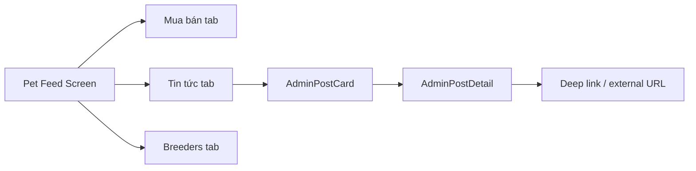

# Admin Features — UI/UX Design & Implementation Plan

> **Mục tiêu:** Tách rõ bài đăng **bán thú cưng** (breeder listing) và bài **chia sẻ từ Pet Health Care** (social / app update); mở rộng **quản lý tài khoản + thú cưng** cho admin; thêm tab **Tin tức** trong Pet Feed.

**Ngày:** 2026-06-17  
**Trạng thái:** Design **confirmed** — sẵn sàng implement

### Quyết định đã chốt (2026-06-17)

| # | Chủ đề | Quyết định |
|---|--------|------------|
| 1 | Tên tab | **Tin tức** |
| 2 | Admin đăng bài bán | **Không** — gỡ luồng listing cho admin |
| 3 | Managed session MVP | **Đầy đủ:** pet CRUD + care schedule + health log |
| 4 | Favorite trên tin admin | **Không** |

---

## 1. Hiện trạng (audit nhanh)

| Khu vực | Hiện tại | Gap |
|--------|----------|-----|
| `pet_feed_posts` | Một schema listing (species, breed, price, vaccine, contact…) | Không phân loại `listing` vs `announcement` |
| `CreatePetFeedPostScreen` | Form đầy đủ cho breeder; admin dùng chung form, publish thẳng | Admin vẫn phải điền giống bài bán |
| `PetFeedScreen` | 2 tab: **Feed** \| **Breeders** | Không có kênh nội dung admin |
| `AdminReviewScreen` | Tạo account + đổi role; moderation queue | Không tạo pet; không “quản lý thay user” |
| `AccountScreen` (admin) | Home redirect; metric cards; nút “Tạo bài” listing | Admin workspace rải rác |
| Backend admin | `POST/PUT /admin/accounts` | Bug: `primaryRole: admin` bị ghi thành `sen` khi create |
| Pet API | `createPetForUser(req.user.id)` | Chỉ user đăng nhập tạo pet cho chính mình |

---

## 2. Nguyên tắc UX

1. **Tách luồng rõ ràng** — Admin chỉ đăng **announcement** (Tin tức); không có form listing / không vào `CreatePetFeedPostScreen`.
2. **Nhận diện thương hiệu** — Tab Tin tức và card announcement có header “Pet Health Care”, không hiện giá / liên hệ mua.
3. **Progressive disclosure** — Form announcement ngắn; form listing giữ nguyên độ phức tạp hiện tại.
4. **Admin workspace tập trung** — Một hub: Users → User detail → Pets → “Quản lý thay user”.
5. **An toàn** — Mọi thao tác thay user qua admin API + audit log; không impersonation token đầy đủ.

---

## 3. Feature A — Bài đăng Admin (Announcement)

### 3.1 Phân loại nội dung

| Loại | `post_kind` | Mục đích | Ví dụ |
|------|-------------|----------|-------|
| Listing | `listing` | Bán / nhận nuôi | Giống hiện tại |
| Announcement | `announcement` | Social, tips, app update | “App 1.1 có nhắc vaccine”, “Mèo nên uống bao nhiêu nước” |

**Category** (lưu trong `metadata.category`):

- `app_update` — Phiên bản app, tính năng mới
- `health_tip` — Mẹo sức khỏe chó/mèo
- `community` — Cộng đồng, sự kiện
- `general` — Tin chung

### 3.2 UI — Composer mới: `CreateAdminPostScreen`

**Entry points (admin only):**

- Home (admin dashboard) → **“Đăng tin Pet Health Care”** (CTA duy nhất cho đăng bài)
- **Gỡ** nút “Tạo bài” listing trên `AccountScreen` / Home admin
- **Chặn** admin mở `CreatePetFeedPostScreen` (frontend + backend từ chối `post_kind=listing` từ admin)

**Form fields:**

```
┌─────────────────────────────────────┐
│ ←  Đăng tin Pet Health Care         │
├─────────────────────────────────────┤
│ ℹ️ Tin này hiện ở tab Tin tức,     │
│    không xuất hiện trong Feed bán.  │
├─────────────────────────────────────┤
│ Loại nội dung                       │
│ [App update] [Mẹo SK] [Cộng đồng]   │
│                                     │
│ Tiêu đề *                           │
│ ┌─────────────────────────────────┐ │
│ │                                 │ │
│ └─────────────────────────────────┘ │
│                                     │
│ Nội dung *                          │
│ ┌─────────────────────────────────┐ │
│ │ (multiline, ~2000 chars)        │ │
│ └─────────────────────────────────┘ │
│                                     │
│ Ảnh (0–6, tùy chọn)                 │
│ [+] [thumb] [thumb]                 │
│                                     │
│ Video (tùy chọn — không bắt buộc)   │
│ [Chọn video]                        │
│                                     │
│ CTA (tùy chọn)                      │
│ Nhãn nút: [Mở app / Xem thêm]       │
│ Link: [pethealth://... hoặc URL]    │
├─────────────────────────────────────┤
│ [Xem trước]  [Đăng ngay]            │
└─────────────────────────────────────┘
```

**Khác biệt so với listing:**

| Field | Listing | Announcement |
|-------|---------|--------------|
| Species / breed / giá | Bắt buộc / quan trọng | Ẩn |
| Video | Bắt buộc | Tùy chọn |
| Contact FB/Zalo | Có | Ẩn |
| Vaccine / paperwork | Có | Ẩn |
| Preview card | `PetFeedPostCard` | `AdminPostCard` (mới) |
| Publish | Breeder → pending; Admin listing → published | Luôn `published` |

### 3.3 UI — Card đọc: `AdminPostCard`

```
┌─────────────────────────────────────┐
│ 🛡 Pet Health Care    · 2 giờ trước │
│ [badge: App update]                 │
│                                     │
│ Tiêu đề bài viết                    │
│ Đoạn mô tả rút gọn 3 dòng…          │
│                                     │
│ [carousel ảnh nếu có]               │
│                                     │
│ [  Mở tính năng mới  ]  ← CTA      │
└─────────────────────────────────────┘
```

- Không có: giá, **favorite** (cố định — không implement), report (giữ report spam), contact breeder
- Tap card → `AdminPostDetailScreen` (full body + media)

### 3.4 Data model

**Migration — cột mới trên `pet_feed_posts`:**

```sql
alter table public.pet_feed_posts
  add column if not exists post_kind text not null default 'listing'
  check (post_kind in ('listing', 'announcement'));

create index if not exists idx_pet_feed_posts_kind_status
  on public.pet_feed_posts(post_kind, status, created_at desc);
```

**Announcement row mapping:**

| DB column | Announcement usage |
|-----------|-------------------|
| `post_kind` | `'announcement'` |
| `title` | Tiêu đề |
| `description` | Body |
| `species` | `''` hoặc `'general'` |
| `breed` | `''` |
| `media_urls`, `video_url` | Như cũ |
| `metadata` | `{ category, ctaLabel, ctaUrl, authorLabel: 'Pet Health Care' }` |
| `breeder_profile_id` | `null` |
| `status` | `published` (admin create) |

**Lý do dùng chung bảng:** Tái sử dụng upload media, pagination, admin moderation; filter theo `post_kind` đủ tách UX.

---

## 4. Feature B — Tab Tin tức trong Pet Feed

### 4.1 Cấu trúc tab

`PetFeedScreen` → 3 tab segment:

```
[ Mua bán ]  [ Tin tức ]  [ Breeder ]
     ↑            ↑            ↑
  listing    announcement   profiles
  only          only
```

**Default tab:** `Mua bán` (giữ hành vi cũ).

**Tab Tin tức:**

- Chỉ `post_kind = announcement` + `status = published`
- Sort: `created_at desc` (phase 2: pin `metadata.pinnedAt`)
- Filter nhẹ: chip category (Tất cả / App / Mẹo SK / Cộng đồng)
- Pull-to-refresh + infinite scroll (cùng pattern feed hiện tại)
- Empty state: “Chưa có tin từ Pet Health Care” + illustration Mai

**Tab Mua bán:** Exclude `announcement` trong API/list client filter.

### 4.2 Wireflow



---

## 5. Feature C — Quản lý tài khoản & thú cưng

### 5.1 Information architecture

Gộp admin tools vào **Admin Hub** (thay vì chỉ `AdminReviewScreen` dài một trang):

```
Account (admin) → Home dashboard
    ├── Đăng tin Pet Health Care  ← chỉ announcement
    ├── [Metric: Requests | Breeders | Posts]  ← giữ
    └── "Quản lý hệ thống" → Admin Hub
            ├── Tab: Người dùng
            ├── Tab: Kiểm duyệt (posts + reports)  ← tách từ AdminReview
            └── Tab: Breeders (verify/suspend)
```

**Tab Người dùng:**

```
┌─────────────────────────────────────┐
│ Tạo tài khoản mới                   │
│ Email · Tên hiển thị · Mật khẩu     │
│ Role: [Sen] [Breeder] [Admin]       │
│ [Tạo tài khoản]                     │
├─────────────────────────────────────┤
│ 🔍 Tìm email / tên                  │
├─────────────────────────────────────┤
│ Nguyễn Văn A · sen@x.com · Sen      │
│                    [Quản lý →]      │
│ Trần B · breeder@x.com · Breeder    │
│                    [Quản lý →]      │
└─────────────────────────────────────┘
```

### 5.2 User detail: `AdminUserDetailScreen`

```
┌─────────────────────────────────────┐
│ ←  Nguyễn Văn A                     │
│ sen@example.com · Sen               │
│ Role: [Sen] [Breeder] [Admin]       │
├─────────────────────────────────────┤
│ Thú cưng (2)          [+ Thêm pet] │
│ ┌─────────────────────────────────┐ │
│ │ 🐱 Miu · Mèo Anh lông ngắn      │ │
│ │ [Quản lý hồ sơ]                 │ │
│ └─────────────────────────────────┘ │
│ ┌─────────────────────────────────┐ │
│ │ 🐕 Lu · Chó Corgi               │ │
│ │ [Quản lý hồ sơ]                 │ │
│ └─────────────────────────────────┘ │
├─────────────────────────────────────┤
│ [Quản lý thay user]                 │
│ Mở Home với ngữ cảnh user này       │
└─────────────────────────────────────┘
```

### 5.3 “Quản lý thay user” (Acting context)

**UX pattern — Managed session banner (không full impersonation):**

Khi admin bấm **Quản lý thay user**:

1. App set `managedUser: { userId, displayName, role }` trong state (không đổi JWT).
2. Banner cố định trên cùng mọi màn pet-related:

```
┌─────────────────────────────────────┐
│ 👤 Đang quản lý: Nguyễn Văn A  [X] │
└─────────────────────────────────────┘
```

3. Home / Pet list / Care schedule / Health log gọi **admin proxy API** với `targetUserId`.
4. Thoát → clear `managedUser`, về Admin Hub.

**Phạm vi MVP (managed session — ship cùng lúc):**

- Pet: xem / tạo / sửa profile (tên, species, breed, avatar, ngày sinh)
- **Care schedule:** xem + chỉnh sửa lịch chăm sóc (cùng UX Home hiện tại)
- **Health log:** xem + thêm/sửa mục nhật ký sức khỏe
- Vaccine reminder, weight log theo pet (reuse màn hình Sen hiện có, proxy API)

**Phase 2 (sau MVP):**

- AI analysis thay user
- Audit log hiển thị trong Admin Hub

**Không làm (tránh rủi ro):**

- Login thật bằng password user
- JWT swap / refresh token impersonation

### 5.4 Form thêm pet (admin)

Reuse `AddPetScreen` UI với prop `mode: 'admin' | 'self'`:

- Title: “Thêm thú cưng cho {displayName}”
- Submit → `POST /admin/users/:userId/pets`
- Success → quay User detail, list refresh

---

## 6. Admin Home dashboard (tinh chỉnh)

Admin hiện bị redirect `account` → `home`. Tổ chức lại **Home khi `role === admin`**:

```
┌─────────────────────────────────────┐
│ Xin chào, Pet Health Care           │
├─────────────────────────────────────┤
│ [ 📢 Đăng tin Pet Health Care ]     │  ← full-width primary CTA
├─────────────────────────────────────┤
│ Kiểm duyệt nhanh                    │
│ · 3 bài chờ duyệt  [Xem]            │
│ · 1 báo cáo mới    [Xem]            │
├─────────────────────────────────────┤
│ [Quản lý người dùng →]              │
└─────────────────────────────────────┘
```

*(Pets của admin cá nhân — nếu có — vẫn có thể xem ở Home khi không ở managed mode; hoặc ẩn pet admin trên production tùy policy.)*

---

## 7. API & Backend plan

### Phase 0 — Bugfix (ưu tiên)

| Task | File |
|------|------|
| Cho `normalizeSignupRole` / `ensureAccountProfile` chấp nhận `admin` khi create qua admin API | `accountRepository.js` |

### Phase 1 — Announcement posts

| Endpoint | Mô tả |
|----------|-------|
| `GET /pet-feed/posts?kind=listing\|announcement` | Filter public feed |
| `POST /pet-feed/announcements` | Admin only; body rút gọn; `post_kind=announcement` |
| `PATCH /admin/announcements/:id` | Sửa / archive |
| Repository | `createAnnouncementPost`, `listAnnouncementPosts` |

Validation announcement:

- `title` required, max 120
- `description` required, max 2000
- Ảnh 0–6; video optional
- `metadata.category` enum

### Phase 2 — Admin managed user (pets + care + health)

| Endpoint | Mô tả |
|----------|-------|
| `GET /admin/users/:userId/pets` | List pets |
| `POST /admin/users/:userId/pets` | Create pet |
| `PUT /admin/users/:userId/pets/:petId` | Update pet |
| `GET/PUT /admin/users/:userId/pets/:petId/care-schedule` | Care schedule (MVP) |
| `GET/POST/PUT /admin/users/:userId/pets/:petId/health-entries` | Health log (MVP) |
| `POST /pet-feed/posts` | Từ chối admin tạo `post_kind=listing` (chỉ announcement route) |
| Middleware | `requireAdminOrSecret` + validate `userId` exists |

Audit (khuyến nghị):

```sql
create table admin_audit_log (
  id uuid primary key default gen_random_uuid(),
  admin_user_id text not null,
  action text not null,
  target_user_id text,
  target_pet_id uuid,
  metadata jsonb default '{}',
  created_at timestamptz default now()
);
```

### Phase 3 — Polish

- Pin announcement (`metadata.pinnedAt`)
- Push notification khi có app update post (future)
- Scheduled publish (`metadata.publishAt`)

---

## 8. Frontend implementation plan

### Sprint 1 — Data + Tab Tin tức (≈3–4 ngày)

- [ ] Migration `post_kind` + deploy backend
- [ ] Types: `PostKind`, `AnnouncementCategory`, extend `PetFeedPost`
- [ ] API: `listPetFeedPosts({ kind })`, `createAnnouncementPost`
- [ ] `AdminPostCard`, `AdminPostDetailScreen`
- [ ] `PetFeedScreen`: tab `news` + filter
- [ ] i18n VI/EN keys

### Sprint 2 — Admin composer (≈2 ngày)

- [ ] `CreateAdminPostScreen` + preview modal
- [ ] Home admin: một CTA **Đăng tin Pet Health Care**
- [ ] Gỡ nút tạo listing cho admin (`AccountScreen`, `openCreatePetFeedPost` guard)

### Sprint 3 — User management UI (≈3 ngày)

- [ ] `AdminHubScreen` với tab Users / Moderation
- [ ] `AdminUserDetailScreen`
- [ ] `AddPetScreen` admin mode
- [ ] Fix create account role admin

### Sprint 4 — Managed session (≈5–6 ngày)

- [ ] State `managedUser` trong `usePetHealthApp`
- [ ] `ManagedUserBanner` component
- [ ] Admin proxy: pets + **care schedule** + **health log**
- [ ] Reuse Home / health screens với `managedUserId`
- [ ] Tests: admin create user → add pet → managed home + schedule + health log

### Files chạm chính

**Backend**

- `context/supabase-schema.sql`
- `repositories/petFeedRepository.js`
- `routes/petFeedRoutes.js`
- `routes/adminRoutes.js`
- `repositories/petRepository.js`
- `repositories/accountRepository.js`

**Frontend**

- `screens/PetFeedScreen.tsx`
- `screens/CreateAdminPostScreen.tsx` (new)
- `screens/AdminHubScreen.tsx` (new)
- `screens/AdminUserDetailScreen.tsx` (new)
- `components/AdminPostCard.tsx` (new)
- `components/ManagedUserBanner.tsx` (new)
- `hooks/usePetHealthApp.ts`
- `api.ts`, `types.ts`
- `locales/vi.json`, `locales/en.json`

---

## 9. i18n keys (draft)

```json
{
  "petFeed.tabs.buy": "Mua bán",
  "petFeed.tabs.news": "Tin tức",
  "petFeed.tabs.breeders": "Breeder",
  "petFeed.newsEmpty": "Chưa có tin từ Pet Health Care",
  "adminPost.createTitle": "Đăng tin Pet Health Care",
  "adminPost.category.appUpdate": "Cập nhật app",
  "adminPost.category.healthTip": "Mẹo sức khỏe",
  "adminPost.category.community": "Cộng đồng",
  "adminPost.publish": "Đăng ngay",
  "adminHub.title": "Quản lý hệ thống",
  "adminHub.users": "Người dùng",
  "adminHub.manageUser": "Quản lý",
  "adminHub.addPet": "Thêm thú cưng",
  "adminHub.actAsUser": "Quản lý thay user",
  "managedUser.banner": "Đang quản lý: {{name}}",
  "managedUser.exit": "Thoát"
}
```

---

## 10. Security & App Store

- Admin announcement không chứa UGC user → vẫn phù hợp moderation hiện tại.
- Report trên announcement: lý do spam / misleading; admin tự archive.
- Managed session: log mọi write; rate limit admin pet APIs.
- Không expose `ADMIN_INTERNAL_API_KEY` trên client — chỉ JWT admin role.

---

## 11. Quyết định đã chốt

| # | Câu hỏi | Quyết định |
|---|---------|------------|
| 1 | Tên tab | **Tin tức** ✓ |
| 2 | Admin đăng listing bán? | **Không** ✓ |
| 3 | Managed session MVP | **Pet + care schedule + health log** ✓ |
| 4 | Favorite trên tin admin? | **Không** ✓ |
| 5 | Push notification khi app update? | Phase 3 / sau App Review |

---

## 12. Thứ tự ship

1. **Bugfix** admin role on create  
2. **Tab Tin tức** + read-only announcement feed  
3. **CreateAdminPostScreen** + gỡ listing path cho admin  
4. **Admin Hub** + user detail + add pet  
5. **Managed session** (pets + care schedule + health log trong một sprint)  
6. **Polish** — pin post, audit log UI, AI analysis thay user (phase 2)

---

*Document owner: team Pet Health Care — cập nhật khi bắt đầu implement từng sprint.*
